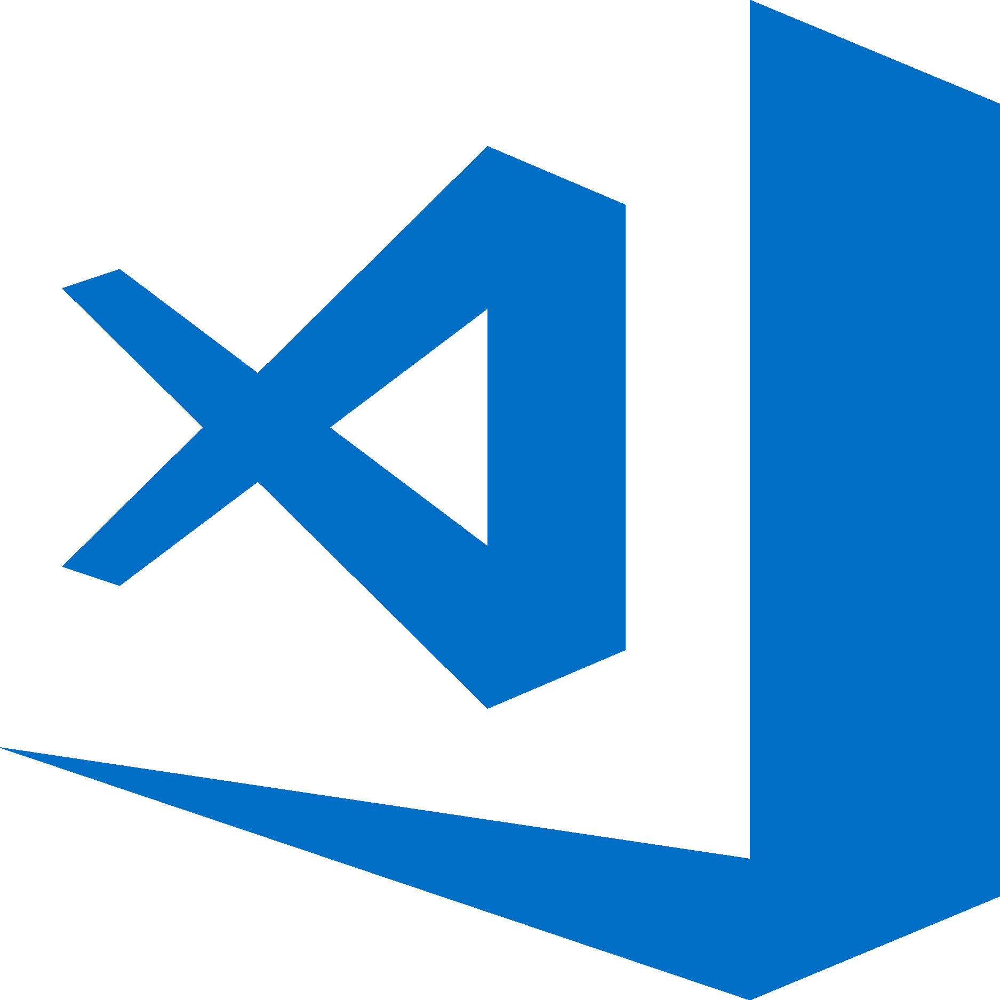

<h1 align="left">
  
</h1>

<h5 align="left">
  <code><a href="https://www.linkedin.com/in/muhammadbagassetiawan" title="LinkedIn Profile"> LinkedIn</a></code>
  <code><a href="https://network.bondex.app/p/HPGJLJO" title="HackerRank Profile">Bondex</a></code>
  <code><a href="https://www.instagram.com/bagstywn/" title="Instagram Profile"> Instagram</a></code>
</h5>
 

  Hi, I’m Muhammad Bagas Setiawan, Information Systems Student & Product Designer/Developer from Indonesia
   
   
  🔬  I’m currently studying Information Systems at Institut Teknologi Kalimantan
   
  🎓 I design and develop scalable web and cross-platform mobile applications
   
  🚀I’m currently exploring Web3 development and Integrate AI services automation workflows using n8n
   
  📚I continuously improve my skills in system design, clean architecture, and DevOps fundamentals
   
  📫 How to reach me: <a href="mailto: mhmmdbagasxy@gmail.com">mhmmdbagasxy@gmail.com</a>

<h2 align="left">Languages | Frameworks | Tools | Abilities</h2>
 

  
  
  
  
  
  
  
  
  
  
  
  
  
  
  
  
  
  
  
  
  
  

<h2 align="left">⚡ Stats ⚡</h2>
 
<!-- 

  

    
    
  

           
  

    
  

   

  <!-- 

 --> 

