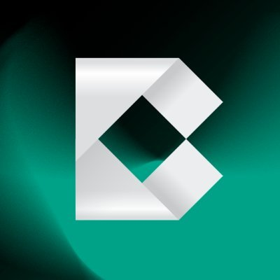
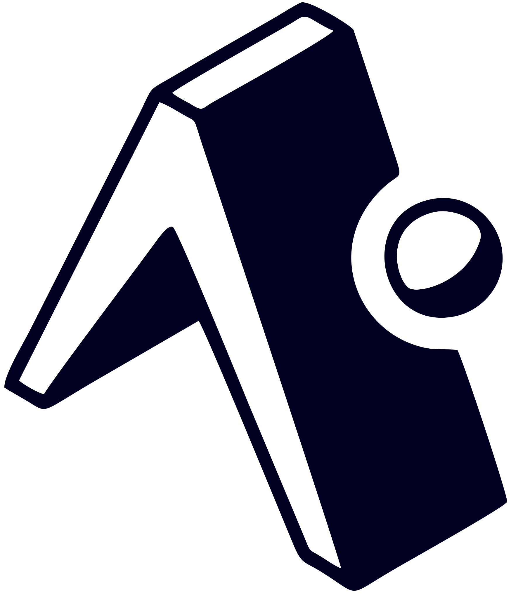
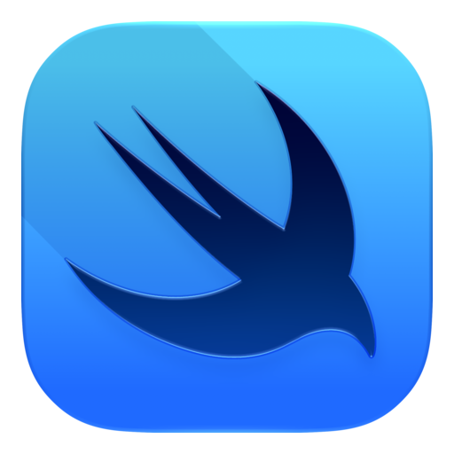
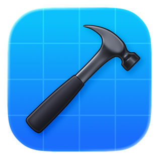
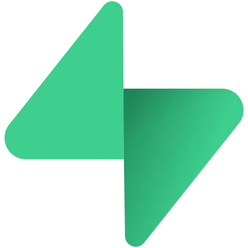
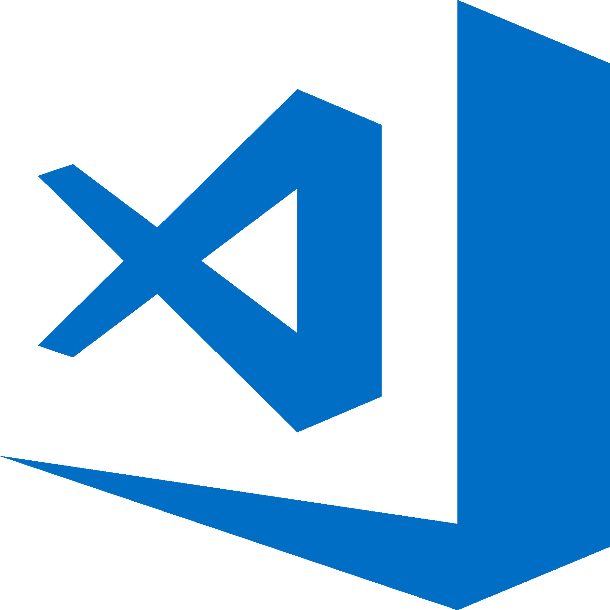
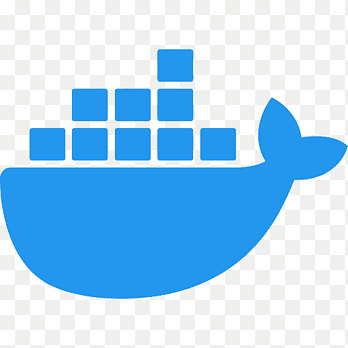

<h1 align="left">
  
</h1>

  <a href="https://www.linkedin.com/in/muhammadbagassetiawan">
    
    <b> LinkedIn</b>
  </a>
  &nbsp;&nbsp;
  <a href="https://network.bondex.app/p/HPGJLJO">
    
    <b> Bondex</b>
  </a>
  &nbsp;&nbsp;
  <a href="https://www.instagram.com/bagstywn/">
    
    <b> Instagram</b>
  </a>
  &nbsp;&nbsp;
  <a href="mailto:mhmmdbagasxy@gmail.com">
    📫 <b>Email</b>
  </a>

  Hi, I’m Muhammad Bagas Setiawan, an Information Systems student interested in
  software engineering, UI/UX design, and mobile development.

  🔬 Currently studying Information Systems at Institut Teknologi Kalimantan
   
  🎨 Enjoy designing user interfaces and experiences using Figma
   
  📱 Focused on building mobile applications with React Native and exploring Swift & SwiftUI
   
  💻 Also build web applications using TypeScript, React, and Next.js
   
  🤖 Exploring AI-assisted development, automation workflows, and Web3 technologies
   
  📚 Strengthening fundamentals in software engineering, application architecture, and DevOps

<h2 align="left">Tech Stack</h2>

<table>
  <tr>
    <td valign="top" width="50%">

### 🎨 Design

  

### 📱 Mobile Development

  
  
  
  
  
  

    </td>

    <td valign="top" width="50%">

### 🌐 Web Development

  
  
  
  
  
  
  

### 🗄️ Backend & Database

  
  
  

    </td>
  </tr>

  <tr>
    <td valign="top">

### 🛠️ Tools & Workflow

  
  
  
  
  

    </td>

    <td valign="top">

### 🔭 Exploring

  Web3 · AI Integration · Automation · Mobile Performance

    </td>
  </tr>
</table>
